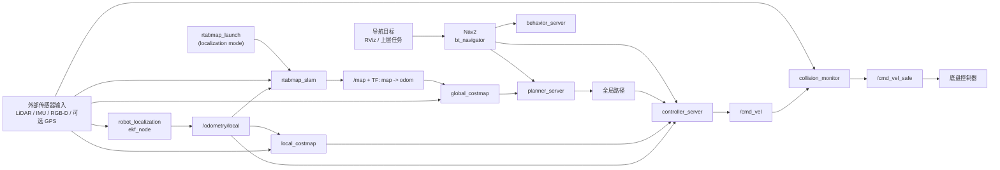
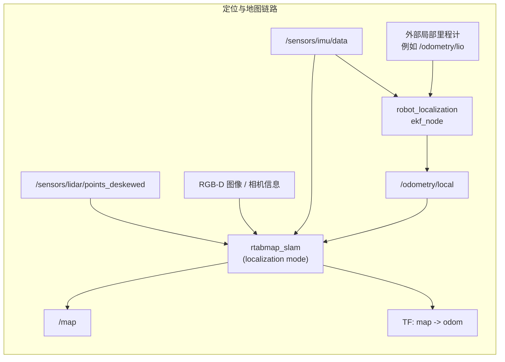
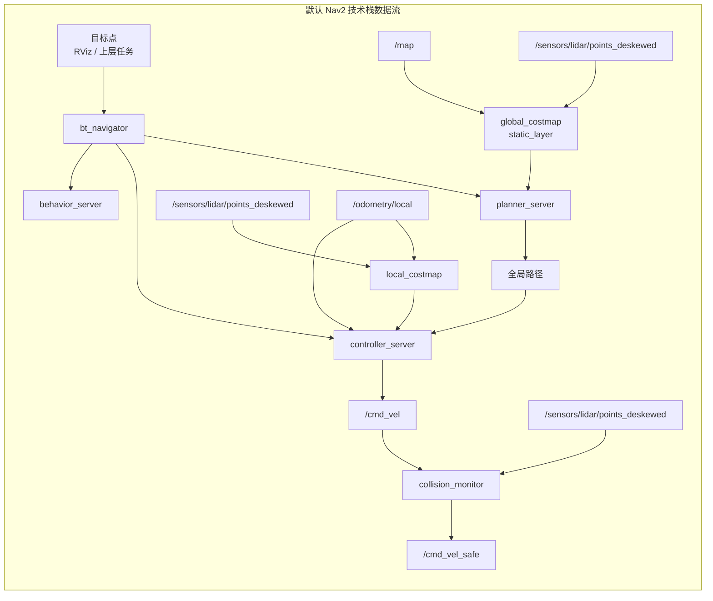

# 默认导航流程说明（Nav2 技术栈）

本文说明本工程在默认导航模式下的节点协作关系、关键数据流向，以及 RTAB-Map 在其中扮演的角色。

## 0. 适用范围

本文对应的启动路径是：

```bash
ros2 launch robot_bringup bringup.launch.py mode:=navigation
```

默认按以下前提理解：

- `mode=navigation`
- `sensor_profile=lidar_rgbd`
- `enable_gps=false`
- RTAB-Map 使用已有数据库做定位，不继续增量建图
- Nav2 使用 `nav2_bringup` 的默认导航技术栈

这里重点描述导航阶段的数据链路，不再展开建图阶段 `icp_odometry -> /odometry/lio -> EKF` 的前端细节。

## 1. 导航过程

`src/robot_bringup/` 目前是本地 `launch/config` 目录，不是独立 ROS 包。
下面只画默认导航模式里实际参与定位、规划、控制和避障的 ROS 包，以及它们和外部传感器输入的关系。

### 1.1 包协作过程



- `robot_localization` 负责提供本地连续位姿 `/odometry/local`，这是整个导航栈的局部运动基准。
- `rtabmap_slam` 在导航阶段工作于 `localization` 模式，负责利用已有地图做重定位，并持续发布 `/map` 和 `map -> odom`。
- Nav2 不直接依赖 RTAB-Map 的内部图优化逻辑，而是消费 RTAB-Map 给出的全局地图与全局坐标关系。
- `planner_server` 基于全局代价地图计算全局路径，`controller_server` 基于局部代价地图和局部里程计跟踪路径。
- `collision_monitor` 位于速度输出最后一级，对 `/cmd_vel` 做安全裁剪，输出 `/cmd_vel_safe` 给底盘。

### 1.2 RTAB-Map 在导航阶段的角色

在本工程默认导航模式里，RTAB-Map 的职责是：

- 读取已有数据库 `database_path` 中的地图
- 用当前传感器数据与已有地图匹配，完成全局定位 / 重定位
- 发布 `/map`
- 发布 `TF: map -> odom`

RTAB-Map 在这里**不负责**：

- 生成本地连续里程计 `odom -> base_footprint`
- 代替 Nav2 做路径规划
- 直接输出底盘速度命令

换句话说，导航阶段的职责边界是：

- `EKF`：局部连续位姿
- `RTAB-Map`：全局地图与全局定位
- `Nav2`：规划、控制、恢复行为
- `collision_monitor`：最终安全门控

## 2. 关键数据流向

### 2.1 位姿与地图侧



- `/odometry/local` 仍然是导航期间 RTAB-Map 与 Nav2 的共同位姿输入。
- RTAB-Map 不是靠 `/map` 做规划，而是负责不断校正 `map -> odom`，让机器人在全局地图里位置稳定。
- 默认 `sensor_profile=lidar_rgbd` 时，RTAB-Map 同时会使用 LiDAR 和 RGB-D 相机输入；如果切成别的传感器模式，这一支路会变化。

### 2.2 Nav2 规划、控制与避障侧



- 全局代价地图工作在 `map` 坐标系，主要依赖 RTAB-Map 提供的 `/map`。
- 局部代价地图工作在 `odom` 坐标系，主要依赖 `/odometry/local` 和近场点云障碍物。
- 默认配置里，全局与局部代价地图的障碍层都使用 `/sensors/lidar/points_deskewed`。
- 控制器输出 `/cmd_vel` 后，还会经过 `collision_monitor`，最终给到底盘的是 `/cmd_vel_safe`。

## 3. 默认配置下各模块的关键输入/输出

### 3.1 RTAB-Map

输入：

- `/odometry/local`
- `/sensors/imu/data`
- `/sensors/lidar/points_deskewed`
- `RGB-D` 相机话题（默认 `sensor_profile=lidar_rgbd`）
- 可选 `/sensors/gps/fix`（仅 `enable_gps=true`）

输出：

- `/map`
- `TF: map -> odom`
- 数据库读写：`database_path`

### 3.2 Nav2

输入：

- `/map`
- `/odometry/local`
- `/sensors/lidar/points_deskewed`
- 目标点 / 导航动作请求

输出：

- `/cmd_vel`
- 行为恢复动作
- 路径、代价地图、调试可视化话题

### 3.3 collision_monitor

输入：

- `/cmd_vel`
- `/sensors/lidar/points_deskewed`
- TF: `odom -> base_footprint`

输出：

- `/cmd_vel_safe`

## 4. 最终 TF 主链

默认导航模式下，工程假定主 TF 关系为：

```text
map -> odom -> base_footprint -> base_link -> sensors
```

其中：

- `map -> odom` 由 RTAB-Map 提供
- `odom -> base_footprint` 由 EKF 提供
- `base_footprint -> base_link` 在当前 bringup 里可由静态 TF 顶上
- `base_link -> sensors` 需要由外部传感器驱动、URDF 或额外静态 TF 保证

## 5. 一句话总结

导航阶段不是“RTAB-Map 接管一切”，而是四层分工：

- `EKF` 负责局部连续位姿
- `RTAB-Map` 负责全局定位和地图坐标
- `Nav2` 负责规划与控制
- `collision_monitor` 负责最终的速度安全门控
